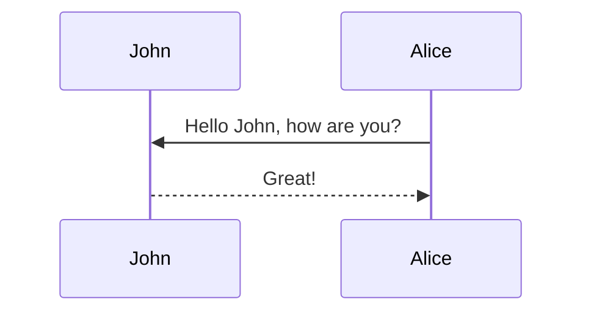

This theme supports generating various diagrams from a text description using [mermaid](https://mermaid-js.github.io/mermaid/){:target="\_blank"}.

## Mermaid

The diagram below was generated by the following code:

````markdown

````


